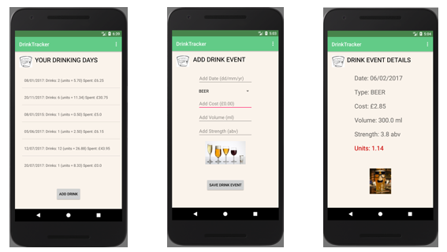

# DrinkTracker

Built for my second project during [CodeClan's](https://codeclan.com/) Professional Software Development Course



## Summary

Working in [Android Studio](https://developer.android.com/studio/index.html), using [Java](https://www.oracle.com/java/index.html#close), this mobile application enables the user to record each alcohol drink they consume including date, cost, type, strength and volume. Data is persisted through shared preferences, and the number of units per drink is calculated once input. The main activity page displays a list of dates with a calculation of the total drinks, cost and units consumed on that date.

## Using the App

You will need Android Studio 3.2.1

### Install Android Studio
```
https://developer.android.com/studio/
```

### Connect your Android device
Find out how here:

```
https://developer.android.com/studio/run/
```

Or you can run the app on the Android Emulator: 

```
https://developer.android.com/studio/run/emulator
```
